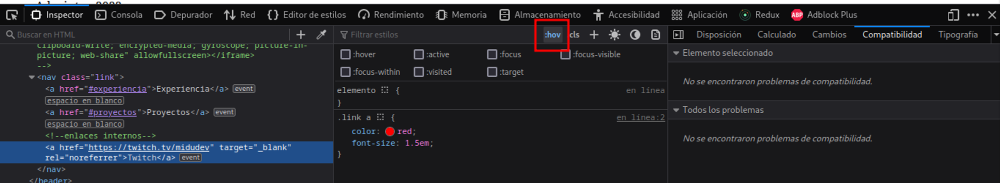
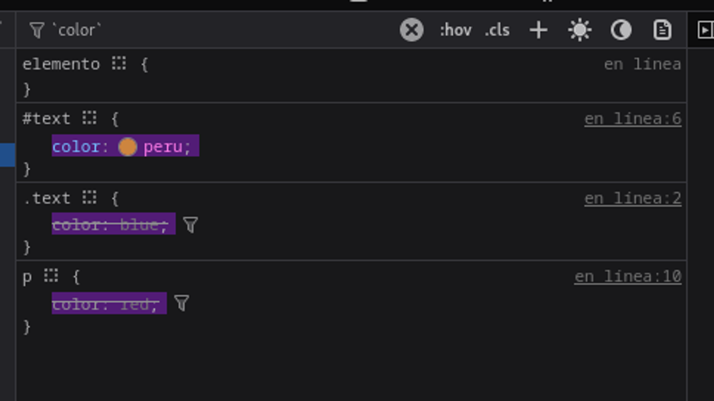
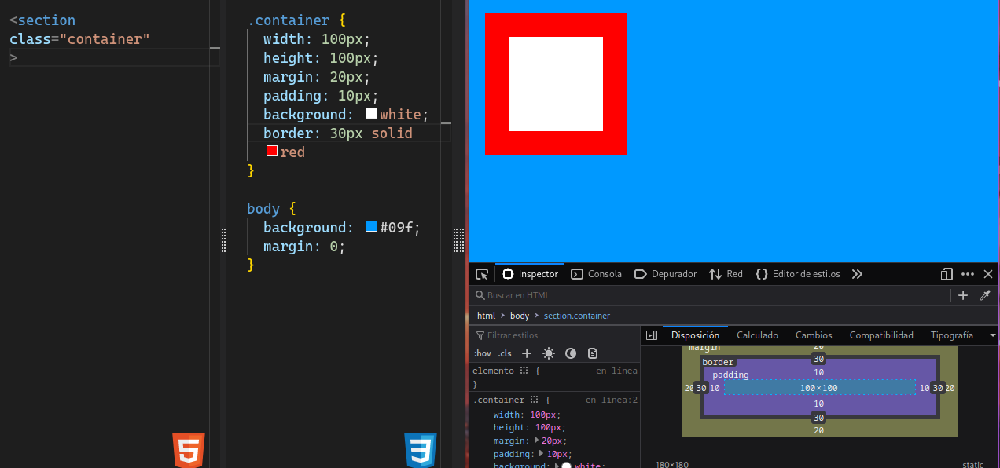

## The styles

The styles can be put into the **head** or the **body** of the HTML document. Altought the usual is put the styles into the **head**.

### Parts

```css
selector {
  propierty: value; /*This line is called declaration*/
}
```

The selector more basic are the **tags**, for example a _h1_ tag:

```css
h1 {
  color: red;
}
```

Also, there are a way _to modify all our document_, with the **body**:

```css
body {
  color: red;
}
```

## Colors

There are a lot of ways to put colors into the CSS, but the most common are:

- `color: rgba(0,0,0,50%)`
- `color: rgb(0 0 0 / 50%)` (mor modern)
- `color: hsl(60, 80%, 20%)` (matriz, saturation, lightness)
- `color: oklch(348 100% 0.5 0.5 / 50%)` (hue, chroma, lightness, opacity)
- `color: transparent` 
- `color: #09f` or `color: #fff` (hexadecimal with 3 digits)
- The above is the same as `color: #0099ff` or `color: #ffffff` (hexadecimal with 6 digits)
- `color: #0099ffff` (the last two digits are the opacity, where **00** is transparent and **ff** is opaque)

### Current color

Current color is a special value that is used to inherit the color of the parent element.


## Border

The most easy form to put a border is have **the width, the style and the color** in the same line:
  
```css
border: 1px solid red;
```

## Classes and ids

This you already know, but in CSS you can use the **class** and **id** to select elements:

```css
#id {
  color
}

.class {
  color
}
```

## Inheritance

### Concept

In the following example, the **h1** tag will inherit the color of the **article** tag.

```html
<article>
  <h1>My title</h1>
</article>
```

```css
article {
  color: red;
}
```

### Font Family

The font family is inherited by default, but you can change it, putting it in the body:

```css
body {
  font-family: system-ui, --apple-system, BlinkMacSystemFont, "Segoe UI", Roboto, Ubuntu, "Helvetica Neue", sans-serif;
}
```

Font family operates with fallbacks, if the first font is not available, the next one will be used.


### Not all is inherited

For example, you can have this example, and as you can see, the `<spam>` not inherit the border of the `<h1>` tag:

```html
<h1 class="texto">
  Hola
  <spam>Se mamo</spam>
</h1>
```

```css
.texto {
  border: 1px solid red;
}
```

### Differents forms of inheritance

There are a lot of ways to inherit, for example, there are these:

- **inherit**: The element will inherit the value of the parent element.
- **initial**: The element will inherit the default value of the property or initial value defined in the css especifications
- **unset**: The element will inherit the value of the parent element, if there is no parent element, the element will inherit the default value of the property or initial value defined in the css especifications
- **revert**: The element will inherit the value of the parent element, if there is no parent element, the element will inherit the default value of the property or initial value defined in the css especifications, if there is no default value, the element will inherit the value of the parent element.

## Pseudo classes

There are some elements with states, for example the **button** element, that have the **hover** state, that is when the mouse is over the button.

```css
button:hover {
  color: red;
}
```

```css
.link a {
  color: red;
  font-size: 1.5em;
}

.link a:hover {
  color: blue;
}
```

All the pseudo classes are:

- **:active**: When the element is clicked
- **:focus**: When the element is focused
- **:hover**: When the mouse is over the element
- **:visited**: When the link is visited
- **:link**: When the link is not visited
- **:first-child**: When the element is the first child of the parent element
- **:last-child**: When the element is the last child of the parent element
- **:nth-child(n)**: When the element is the nth child of the parent element
- **:nth-last-child(n)**: When the element is the nth child of the parent element, but counting from the end

> This states can be simulated in the dev tools of the browser



## Difference between border and outline (contorno)

The border is something that **affect to the content.**. In the other hand, the outline is something that **is drawed above the content**

```html
<nav class="link">
  <a>Enlace 1</a>
  <a>Enlace 2</a>
  <a>Enlace 3</a>
</nav>
```

```css
/* .link a:hover{
      border: 5px solid red;
    } */

.link a:hover{
      outline: 5px solid red;
    }
```

## Combined selectors

The use of **combined selectors** is the following:

```html
<p class="description">
  Joven emponzoñado de <strong class="bold"> whisky</strong>,menuda <strong class="bold"> figurota </strong>
</p>

<p class="secondary">
  Joven emponzoñado de <strong class="bold"> whisky</strong>,menuda <strong class="bold"> figurota </strong>
</p>
```

```css
p {
  font-size: 48px;
}

.description .bold {
  color: #09f;
}

.secondary .bold {
  color: red;
}
```

### There are propierties that can be put more than one time

```html
<ul>
  <li> Item 1 </li>
  <li> Item 2 </li>
  <li> Item 3 </li>
  <li>
    <ul>
      <li> Item 3.1 </li>
      <li> Item 3.2 </li>
      <li> Item 3.3 </li>
    </ul>
  </li>
</ul>
``````

```css
ul {
  font-size: 48px;
}

ul li {
  opcaity: 70%;
}
```

### Operators

- **direct child operator**: `ul > li`
  ```html
    <article>
      <p> This is a paragraph </p>

      <footer>
        <p> This is a paragraph </p>
      </footer>

      <p> This is a paragraph </p>
    </article>
  ```
  ```css
    article > p {
      color: red;
    }
  ```
- **next sibling operator**: `ul ~ li`
  ```html
    <article>
      <span> This is a span </span>

      <p> This is a paragraph </p>

      <span> This is a span </span>

      <footer>
        <p> This is a paragraph </p>
      </footer>

      <p> This is a paragraph </p>

      <span> This is a span </span>

    </article>
  ```
  ```css
    p ~ span {
      color: red;
    } 
  ```
- **next direct sibling operator immediately following**: `ul + li`
  ```html
    <article>
      <p> This is a paragraph </p>

      <span> This is a span </span>

      <br/>

      <span> This is a span </span>

    </article>
  ```
  ```css
    p + span {
      color: red;
    } 
  ```
- **descendant combinator**: `ul li`
- **universal selector**: `*`

### A little example with a use

Imagine you have a **navbar** with several buttons. So you want to put a **margin** between the buttons, but not put it in the first button, so you can do this:

```html
<nav>
  <button>Home</button>
  <button>Blog</button>
  <button>Portfolio</button>
  <button>About</button>
</nav>
```

```css
button + button {
  margin-left: 10px;
}
```

## Waterfall / Cascade

Let's see the following example:

```html
<p>
  Vamos a ver como funciona la cascada de estilos
</p>
```

```css
p {
  color: red;
}

p {
  color: blue;
}
```

In this case, the color of the text will be **blue**, because the last declaration is the one that will be applied.

## Especificidad

There are certain attributes that make something **have more weight than others**, for example, in the moment to apply styles. This is the order of the attributes, from the most important to the least important:

- **!important**: This is the most important, and it is used when you want to override a style that is already applied. For exmple: `color: red !important;`
- **Inline styles**: This is the second most important, and it is used when you want to apply a style to a specific element. For example: `<p style="color: red">`
- **IDs**: This is the third most important, and it is used when you want to apply a style to a specific element.
- **Classes, pseudo-classes and attributes**: This is the fourth most important, and it is used when you want to apply a style to a specific element.
- **Elements and pseudo-elements (tags)**: This is the fifth most important, and it is used when you want to apply a style to a specific element.
- **Inheritance**: This is the sixth most important, and it is used when you want to apply a style to a specific element.
- **Default browser styles**: This is the seventh most important, and it is used when you want to apply a style to a specific element.

### Example

```html
  <p class="text">
    Vamos a poner un texto
  </p>
```

```css
  p {
    color: red;
  }

  .text {
    color: blue;
  }
```

In this [page](https://specificity.keegan.st/) we can see the specificity of the selectors. Also in the **devtools** we can see how the styles are sobreescribed and the specificity of the selectors.



## Relative and absolute units

The **most basic absolute unit** is the _pixel_. The pixel is a unit that is used to measure the size of the screen. The pixel is the smallest unit of the screen.

```html
<div class="container">
</div>
```

```css
.container {
  width: 100px;
  height: 100px;
  background: red;
}
```

> Even so the pixels aren't 100% absolute, because the size of the pixel depends of the screen. A 4k screen has more pixels than a 1080p screen, so the size of the pixel is smaller.

### The percentaje (%)

It is a relative unit, because it depends of the parent element. For example, if we have the following code:

```html
<div class="container">
  Este es un texto
</div>
```

```css
.container {
  width: 50%;
  height: 50%;
  background: red;
}
```

### Relative to the viewport

In this case the unit is relative to the viewport, that is the size of the screen. For example, if we have the following code:

```html
<div class="container">
  Este es un texto
</div>
```

```css
.container {
  width: 50vw;
  height: 50vh;
  background: red;
}
```

## Reset CSS and normalize

The [css reset](https://meyerweb.com/eric/tools/css/reset/) made sense in its day when each browser did what it wanted with the styles, now it is not so good practice.

Nowadays, is used the [normalize](https://necolas.github.io/normalize.css/), to renderize the styles in the same way in all the browsers, withoud the need for reset all its styles.

## Box Model

- The **div** works in block by default, that is, it occupies all the width of the screen.
  
  ```html
  <span> This is a text </span>

  <div class="container">
    Texto
  </div>

  <div class="container">
    Texto
  </div>
  ```
  
  ```css
  .container {
  width: 50px;
  height: 50px;
  background: white;
  }

  body {
    background: #09f;
    margin: 0;
  }
  ```

- The **span** works in line by default, that is, it occupies the width of the text.

  ```html
  <span> This is a text </span>
  <span> This is a text </span>
  <span> This is a text </span>
  <span> This is a text </span>
  <span> This is a text </span>
  <span> This is a text </span>
  <span> This is a text </span>
  ```

These elements doesn't have the **width** and **height** propierties, so you can't affect them. 

### Padding and margin

**Padding** is the space between the content and the border. **Margin** is the space between the border and the next element.

> **Important**:
> - When you **change the padding** also is changed the size. This can ve seen in the **devtools**.
> - When you **change the margin** also is changed the size. This can ve seen in the **devtools**.
> - Even you **change the border of the box** also is changed the size.

This can be complicated, because you can't know the size of the box exactly. 



### Box sizing

By default, the **box-sizing** property is `content-box`. With CSS we can change this property to `border-box`, that is, the size of the box will be the size of the content, the padding and the border.

  ```css
  .container {
    width: 50px;
    height: 50px;
    background: white;
    box-sizing: border-box;
  }
  ```


